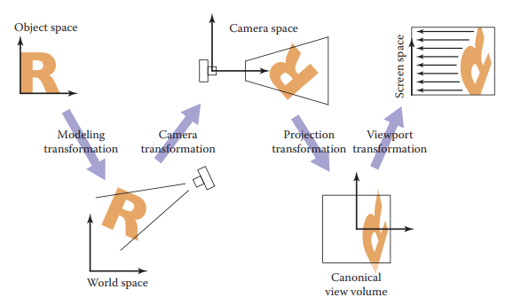
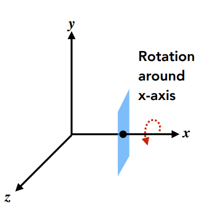
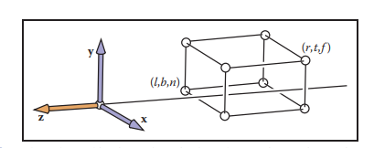
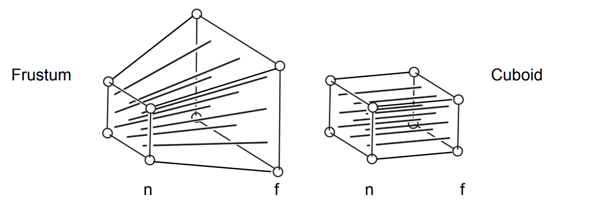
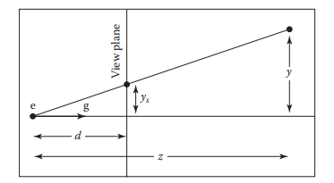
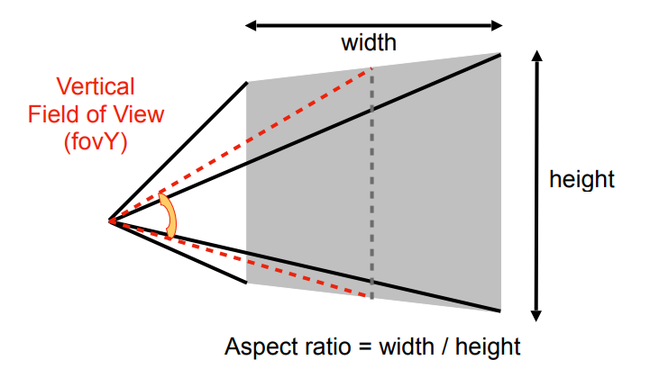
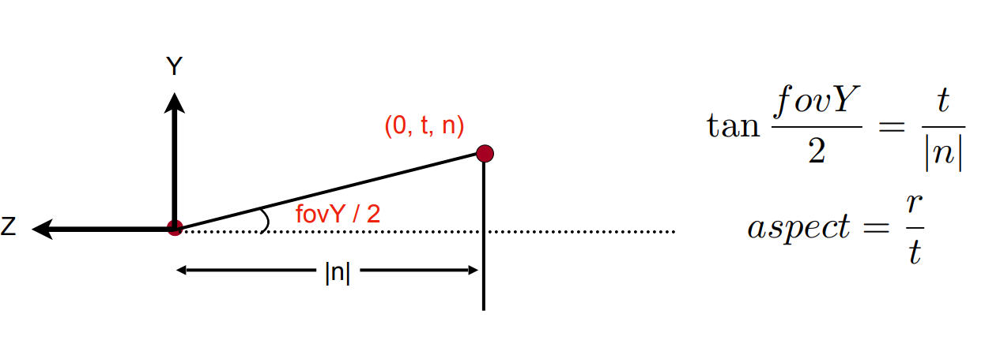

## 作业1  学习笔记

## 一、Viewing transformation

    Viewing transformation has the job of mapping 3D locations, represented as (x,y,z) in the canonical coordinate system tp coordinate in the image, expressed in units of pixels.

    Viewing transformation is a complicated beast that depends on many different things, which can be break up into several simple transformations known as MVP transformation.

1. model transformation : perform a transformation such as rotation,translation on the object in the 3D space

2. viewing transformation :  put the camera at the right space

3. projection transformation : projects the object in the 3D space onto 2D image space in the range -1 to 1 in x and y

4. view port transformation : maps this unit image rectangle to the desired rectangle in pixel coordinates

this four steps can be illustrated  as follows:



## 二、model transformation

model transformation 主要对三维空间中的物体进行位置以及姿态的变换，比如平移旋转切变放缩等等。作业1中要求实现的是绕z轴的旋转：

绕轴旋转可以类比二维空间中的旋转。最后一行以及最后一列都是[0,0,0,1],因为是齐次坐标系，最后添加的最后一个坐标只是为了将平移统一为linear transformation,并不参与变换。实际上的变换是在左上角的$3 \times3$的矩阵内进行计算的。绕x轴旋转时，x坐标是不会发生变化的，只有y和z的坐标发生变化，实际上就是在y和z平面上上做二维的变化，只需要将对应的yz替换成二维平面中的旋转transformation即可。



可以看到：绕y轴的旋转和绕x轴以及绕z轴的并不相同。这里说的旋转都是看向需要旋转的坐标轴并且顺时针旋转，如图。绕x轴顺时针旋转是y叉乘z,绕z轴旋转是x叉乘y但是绕y轴旋转却是z叉乘x。

绕x轴旋转：

$$
R_x(\alpha)=
\begin{bmatrix}
1&0&0&0\\
0&cos(\alpha)&-sin(\alpha)&0\\
0&sin(\alpha)&cos(\alpha)&0\\
0&0&0&1\\
\end{bmatrix}
$$

绕y轴旋转：

$$
R_y(\alpha) = 
\begin{bmatrix}
cos(\alpha)&0&sin(\alpha)&0\\
0&1&0&0\\
-sin(\alpha)&0&cos(\alpha)&0\\
0&0&0&1\\
\end{bmatrix} 
$$

绕z轴旋转：

$$
R_z(\alpha) = 
\begin{bmatrix}
cos(\alpha)&-sin(\alpha)&0&0\\
sin(\alpha)&cos(\alpha)&0&0\\
0&0&1&0\\
0&0&0&1\\
\end{bmatrix}
$$

绕过原点的任意轴进行旋转：Rodrigues' Rotation Formula

rotation with angle $\alpha$ around axis n.

$$
R(n,\alpha) = cos(\alpha)I + (1-cos(\alpha))nn^T + sin(\alpha)
\begin{bmatrix}
0&-n_z&n_y\\
n_z&0&-n_x\\
-n_y&n_x&0\\
\end{bmatrix}
$$

## 三、viewing transformation

viewing transformation需要将相机摆放到正确的位置。定义相机的位置需要三个变量：位置，gaze-at(看向)，up-direction。

通常相机需要摆放到原点，看向-z方向，up-direction为y。

在对相机做viewing transformation的时候只需要对三维空间中的所有物体都做相同的变换保证相对位置相同最后的结果就会相同。

假设相机的初始位置为e,看向为g,up-direction为t。

viewing transformation 需要做到四个步骤：

1. 将相机移动到原点

2. 将g旋转到-z

3. 将t旋转到y

4. 将($g \times t$)旋转到x

平移操作：

$$
T_{view} = 
\begin{bmatrix}
0&0&0&-x_e\\
0&0&0&-y_e\\
0&0&0&-z_e\\
0&0&0&1\\
\end{bmatrix}
$$

将g旋转到(0,0,-1),将t旋转到(0,1,0),将$(g\times t)$旋转到(1,0,0)是比较难的，但是反过来就是比较简单的。可以直接写出变换矩阵。

$$
R_{view}^{-1} = 
\begin{bmatrix}
x_{g\times t} & x_t & -x_g & 0\\
y_{g\times t} & y_t & -y_g & 0\\
z_{g\times t} & z_t & -z_g & 0\\
0 & 0 & 0 & 1\\
\end{bmatrix}
$$

同时旋转矩阵是正交矩阵,也就是$R_{view}^{-1} == R_{view}^{T}$,也就是

$$
R_{view} = 
\begin{bmatrix}
x_{g\times t} & y_{g\times t} & z_{g\times t} & 0\\
x_{t} & y_{t} & z_{t} & 0\\
-x_{g} & -y_{g} & -z_{g} & 0\\
0 & 0 & 0 & 1\\
\end{bmatrix}
$$

最后view transformation的矩阵为

$$
M_{view} = R_{view} \times T_{view} 
$$

## 四、projection transformation

projection transformation 主要是将物体从三维空间中投影到二维的平面上。主要有两种投影的方式：正交投影(orthographic projection)以及透视投影(perspective transformation)

1. the orthographic projection transformation
   
   首先需要定义一个view volume ,个人感觉view volum实际上就是想要看的范围，比如在一个volume里面包含了一个object，当然一个object肯定不是规则的图形，但是可以用一个view volume 将其包含，将view volume通过orthographic transformation投影到canonical view volume的话，view volume中的object也在canonical view volume中，最后将view volume放大泛化的话可以是整个3D空间。在理解的过程将其视为一个长方体较好理解。
   
   长方体的定义为

$$
[l,r] \times [b,t] \times [n,f]
$$
   
   left 和 right为x坐标，表示左和右，bottom和top为y坐标，表示上和下，near和far为z坐标，表示近和远。



   下一步需要将view volume 通过orthographic transformation 投影到 canonical view volume中。两个步骤：

1. 将中心点移动到原点

2. scaling transformation

```math
M_{ortho} = 
  \begin{bmatrix}
  \frac{2}{r-l} & 0 & 0 & 0 \\
  0 & \frac{2}{t-b} & 0 & 0 \\
  0 & 0 & \frac{2}{n-f} & 0 \\
  0 & 0 & 0 & 1\\
  \end{bmatrix}
  \times
\begin{bmatrix}
1 & 0 & 0 & -\frac{r+l}{2}\\
0 & 1 & 0 & -\frac{b+t}{2}\\
0 & 0 & 1 & -\frac{n+f}{2}\\
0 & 0 & 0 & 1
\end{bmatrix}
=
\begin{bmatrix}
\frac{2}{r-l} & 0 & 0 & -\frac{r+l}{r-l} \\
0 & \frac{2}{t-b} & 0 & -\frac{t+b}{t-b} \\
0 & 0 & \frac{2}{n-f} & -\frac{n+f}{n-f} \\
0 & 0 & 0 & 1\\
\end{bmatrix}
```
2. the perspective projection transformation
   
   透视投影的操作目的同样是将view volume转换为canonical view volume.
   
   
   
   不过这里的view volume并不是长方体，而是frustum,之前理解错误了，我以为的是要将远平面投影到近的平面上面，因为投影吗，按照我之前学习的理解就是将一个平面投影到另一个平面上面，但是投影变换并不是如此，同样是要将view volume 投影到canonical view volume 上面去，不过此处的view volume是frustum（学了三回终于搞懂了）。
   
   由此可见，要将frustum投影到canonical view volume 上面，可以分为两个步骤。
   
   1. 将frustum压缩为view volume 也就是正交投影的长方体
   
   2. 通过正交投影将view volume 投影为canonical view volume
   
   
$$
   y'=\frac{n}{z}y\\
x'=\frac{n}{z}x\\
$$
   
   根据上面的公式推导可知
   
```math
   M_{perspective2ortho} *
\begin{bmatrix}
x\\
y\\
z\\
1\\
\end{bmatrix} = 
\begin{bmatrix}
x'\\
y'\\
z'\\
1
\end{bmatrix} 
= 
\begin{bmatrix}
nx\\
ny\\
unknown\\
z\\
\end{bmatrix}
```
   
   为什么z是unknown的呢？
   
   1. 远平面上点压缩之后z不变
   
   2. 近平面上的点压缩之后不变
   
   3. 但是远平面和近平面中间的点z回发生变化
   
   根据上面的公式可以推知：
   
```math
   M_{perspective2ortho} = 
\begin{bmatrix}
n & 0 & 0 & 0\\
0 & n & 0 & 0\\
? & ? & ? & ?\\
0 & 0 & 0 & 1\\
\end{bmatrix}
```
   
   根据1&2可以知道
   
$$
   M_{perspective2ortho} \times 
\begin{bmatrix}
x\\
y\\
n\\
1\\
\end{bmatrix}=
\begin{bmatrix}
x\\
y\\
n\\
1\\
\end{bmatrix}=
\begin{bmatrix}
nx\\
ny\\
n^2\\
n\\
\end{bmatrix}
$$
   
$$
   [0\ 0\ A\ B] \times 
\begin{bmatrix}
x\\
y\\
n\\
1\\
\end{bmatrix} = n^2
$$
   
$$
   [0\ 0\ A\ B] \ times
\begin{bmatrix}
0\\
0\\
f\\
1\\
\end{bmatrix} = 
\begin{bmatrix}
0\\
0\\
f^2\\
f\\
\end{bmatrix}
$$
   
   so
   
$$
   A = n + f\\
B = -nf
$$
   
   so
   
$$
   M_{perspective} = M_{ortho}M_{perspective2ortho}
$$
   
   由前面可知，需要知道[l,r],[b,t],[n,f]
   
   那么实际上应该如何表示这六个数：
   
   
   
   引入两个变量：

4. vertical field of View(fovY)：垂直可视角度

5. aspect ratio:width / height
   
   可以通过以上两个变量计算六个数值。
   
   

## 五、the viewport transformation

We assume that the geometry we want to view is in the canonical view volume and we wish to view the object using a camera looking at the -z direction. A canonical view volume is the cube contian all 3D points whose Cartesian coordinates is between -1 and 1 that is $(x,y,z) \in [-1,1]^3$.

What we need to do next is mapping the square $[-1,1]^2$ to the rectangle on the screen. Each pixels owns a unit square centered at integer coordinates. So if we want to draw onto a image or screen with $n_x \times n_y$, that is we need to map $[-1,1]^2$ to the rectangle [-0.5,nx - 0.5] and [-0.5,ny - 0.5].

实际上这种过程可以通过model transformation实现，也就是window transformation.

将$[-1,1] \times [-1,1]$ 映射到[-0.5,n_x - 0.5]\times [-0.5,n_y - 0.5]$.

1. 将[-1,-1]移动到原点

2. scaling transformation

3. 将原点移动到[-0.5,-0.5]

最终的变换矩阵为：

```math
M_{vp} = 
\begin{bmatrix}
1 & 0 & -0.5\\
0 & 1 & -0.5\\
0 & 0 & 1\\
\end{bmatrix}

\times

\begin{bmatrix}
\frac{n_x}{2} & 0 & 0\\
0 & \frac{n_y}{2} & 0\\
0 & 0 & 1\\
\end{bmatrix}

\times

\begin{bmatrix}
1 & 0 & 1\\
0 & 1 & 1\\
0 & 0 & 1\\
\end{bmatrix}

=


\begin{bmatrix}
\frac{n_x}{2} & 0 & \frac{n_x - 1}{2}\\
0 & \frac{n_y}{2} & \frac{n_y - 1}{2}\\
0 & 0 & 1\\
\end{bmatrix}
$$

实际上在最后的view port transformation中z的距离的远近是可以忽略的，因为投影方向上的点的距离的远近并不影响点在图像上的最后的位置。将二维扩展为三维即可。

$$
M_{vp} = 
\begin{bmatrix}
\frac{n_x}{2} & 0  & 0 & \frac{n_x - 1}{2}\\
0 & \frac{n_y}{2} & 0 & \frac{n_y - 1}{2}\\
0 & 0 & 1 & 0\\
0 & 0 & 0 & 1\\
\end{bmatrix}
$$

通过model transformation、view transformation、projection transformation、viewport transformation最终可以将3D object显示到2D image上。
