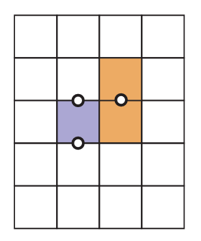

### 光栅化器类

成员变量：

MVP变换矩阵

pos_buf

ind_buf

frame_buf

depth_buf

int width,height; 图像的分辨率

int next_id = 0;


疑问：pos_buf和ind_buf为什么要设计成key-value的map.为什么要使用idx作为索引呢？

疑问解答：光栅化器是需要对3d空间中的每一个三角形进行成像，也就是需要在光栅化器类的内部记录每个三角形的位置，和三角形内部的顶点的编号。之前理解错误了，我以为map的value是三角形的每一个顶点。


成员函数：

```cpp
int get_next_id() { return next_id++; }
```

```cpp
rst::pos_buf_id rst::rasterizer::load_positions(const std::vector<Eigen::Vector3f> &positions)
{
    auto id = get_next_id();
    pos_buf.emplace(id, positions);

    return {id};
}
```

初始化pos_buf,给每个pos一个next_id


```cpp
rst::ind_buf_id rst::rasterizer::load_indices(const std::vector<Eigen::Vector3i> &indices)
{
    auto id = get_next_id();
    ind_buf.emplace(id, indices);

    return {id};
}
```

初始化ind_buf,给每个ind一个next_id


在main函数中，先调用load_positions然后再调用load_indices,也就是positions对应的next_id是0，indices对应的next_id为1.

set_model,set_view以及set_projection没得说，初始化光栅器类的MVP变换矩阵。


```cpp
void rst::rasterizer::draw(rst::pos_buf_id pos_buffer, rst::ind_buf_id ind_buffer, rst::Primitive type)
{
    
}
```

光栅化器类中十分重要的绘制函数。传入参数：需要绘制的三角形的vertex以及ind的对应idx，以及物体的原型。内部的代码逻辑：

1. 扩展为齐次坐标系

2. 对每个顶点进行MVP变换

3.  vec /= vec.w() -> 保证第四个维度为1

4.  对三角形的顶点进行viewport 变换（这里并没有使用矩阵变换的形式）
   
   对于x和y的变换(可以通过view_port_transformation可知)：
   
   ```cpp
   vert.x() = 0.5*width*(vert.x()+1.0);
   vert.y() = 0.5*height*(vert.y()+1.0);
   ```
   
   z不是不变吗？？？？为什么需要做以下变换？？？
   
   ```cpp
   float f1 = (100 - 0.1) / 2.0;
   float f2 = (100 + 0.1) / 2.0;
   vert.z() = vert.ze() * f1 + f2
   ```

5. 初始化三角形类的顶点坐标以及三角形的顶点属性

6. rasterize_wireframe(t);

代码上的小设计：

为了避免传错pos_buf_id以及ind_buf_id，两个id都是使用结构体进行保存的，传错的话会报编译错误。

```cpp
struct pos_buf_id
{
    int pos_id = 0
};

struct ind_buf_id
{
    int ind_id = 0;
};
```

为了保证平移变化也是三维变化，使用的是齐次坐标系，也就是第四维度，向量为0，点为1.

```cpp
auto to_vec4(const Eigen::Vector3f& v3, float w = 1.0f)
{
    return Vector4f(v3.x(), v3.y(), v3.z(), w);
}
```

```cpp
void rst::rasterizer::rasterize_wireframe(const Triangle& t)
{
    draw_line(t.c(), t.a());
    draw_line(t.c(), t.b());
    draw_line(t.b(), t.a());
}
```

第一次作业中光栅化渲染的最重要的函数：draw_line

```cpp
void rst::rasterizer::draw_line(Eigen::Vector3f begin, Eigen::Vector3f end)
{
    
}
```

Bresenham's line drawing algorithm:

在屏幕上画一条直线也并不是十分容易的事情，对于给定的两个坐标(x0,y0)以及(x1,y1)，在屏幕上画出一条直线实际上就是要找到合理的像素集合近似表示一条直线。

直线的表达式：

$$
f(x,y) \equiv (y_0 - y_1)x + (x_1 - x_0)y + x_0y_1 - x_1y_0 = 0 \tag 1
$$


直线的斜率为：

$$
m = \frac{y_1 - y_0}{x_1 - x_0}
$$

下面讨论的是

$$
m \in (0,1]
$$

之间的情况，其他情况可以类似的分类讨论。

在这种情况下，x的变化速度是要比y更加快速的。midpoint algorithm 中最重要的假设就是我们需要画出尽可能薄的线段并且没有间隙。两个像素之间的对角线连接并不被视为gaps。在考虑的m的取值范围上面，从起点开始到终点之前，一个个选择pixel的过程里只有两种选择：一种是直接向右在同一行上面，一种是对角线向上。并且每一列只能由一个像素：0个像素的话会存在gap,两个像素的话线段太厚。按照以上说法，就是要遍历水平方向上的每一列并选择元素，伪代码如下：

```python
y = y0;
for x in (x0,x1+1):
    draw(x,y) 
    if(somecondition):
        y = y + 1
```

伪代码的直观解释就是：“keep drawing pixels from left to right and sometimes move upward in the y-direction”.关键在于什么时候需要在y方向上移动一位。

看中点，假设当前绘制的pixel坐标为(x,y)，那么下一个pixel的选择为(x + 1,y)或者是(x + 1,y +1)，两个候选的节点的中点是(x + 1,y + 0.5)，查看中点在直线的上方还是下方，如果中点在直线的上方，选择(x + 1,y);如果在直线的下方选择(x + 1,y + 1)。

如何判断中点与直线之间的位置关系呢？根据公式1可知f(x,y) = 0 表示在直线上；f(x,y) > 0 在直线的一侧；f(x,y) < 0 在直线的另一侧。由于直线的斜率在(0,1)之间，也就是 >0 在上方，小于零在下方。

那么伪代码可以修改成：

```python
y = y0
for x in (x0,x1+1):
    draw(x,y)
    if(f(x+1,y+0.5) < 0):
        y = y + 1
```

以上就是斜率在0-1之间的推导，其他斜率也可以根据相同的方式进行推导。一共有四种情况：

$$
(0,1]\ and\ (-\infty,-1]\ and\ (-1,0]\ and \ (1,+\infty)
$$

实际上mid-point algorithm 是可以改的更加有效率的：主要的计算开销在于计算f(x + 1,y + 0.5),在上一步的循环过程中，可能计算过：f(x,y+0.5) 或者是f(x,y-0.5)如图,并且：

$$
f(x + 1,y) = f(x,y) + (y0-y1) \tag 2
$$


$$
f(x+1,y+1) = f(x,y) + (y_0,y_1) + (x_1 - x_0) \tag 3
$$


f(x+1,y+1) = f(x,y) + (y_0,y_1) + (x_1 - x_0) \tag 3



this allow us to write a incremental version of the code:

```python
y = y0
d = f(x0 + 1,y0 + 0.5)
for x in range(x0,x1):
    draw(x,y)
    #选择(x + 1,y + 1)
    #下一个需要判断的就是(x+2,y+1.5)
    #根据公式3计算
    if(d < 0):
        y = y + 1
        d = d + (x1 - x0) + (y0 - y1)
    #选择(x+1,y)
    #下一个需要判断的是(x+2,y+0.5)
    #根据公式2计算
    else:
        d = d + (y0 - y1)
```

增量式的代码运行速度较快，因为使用了上一个循环中计算的结果。如果lines很长的话，最好还是把(x1-x0)等存为变量因为编译器并不一定帮助我们实现。看了以下代码逻辑，并不尽相同，后面可以根据书上的内容自己写一遍。


总而言之，draw_line函数原型如下：

```cpp
void rst::rasterizer::draw_line(Eigen:: Vector3f begin,Eigen::Vector3f end)
{
    
}
```

通过以上描述的画直线的方法在begin和end之间不断挑选pixel并将挑选的pixel通过set_pixel设置为对应线段的颜色。将二维屏幕转换为一维数组进行存储。

```cpp
void rst::rasterizer::set_pixel(const Eigen::Vector3f& point, const Eigen::Vector3f& color)
{
    //old index: auto ind = point.y() + point.x() * width;
    if (point.x() < 0 || point.x() >= width ||
        point.y() < 0 || point.y() >= height) return;
    auto ind = (height-1-point.y())*width + point.x();
    frame_buf[ind] = color;
}
```

至此最关键的光栅化类就算是完全拆解完毕。总的来说，光栅器类主要实现了以下操作：

1. MVP transformation

2. viewport transformation

3. draw_line

最后得到整个屏幕每个pixel的属性：frame_buf


### Triangle类：

没啥好说的。


### main 函数：

最主要的循环过程：

```cpp
while (key != 27) {
        r.clear(rst::Buffers::Color | rst::Buffers::Depth);

        r.set_model(get_model_matrix(angle));
        r.set_view(get_view_matrix(eye_pos));
        r.set_projection(get_projection_matrix(45, 1, 0.1, 50));

        r.draw(pos_id, ind_id, rst::Primitive::Triangle);

        cv::Mat image(700, 700, CV_32FC3, r.frame_buffer().data());
        image.convertTo(image, CV_8UC3, 1.0f);
        cv::imshow("image", image);
        key = cv::waitKey(10);

        std::cout << "frame count: " << frame_count++ << '\n';

        if (key == 'a') {
            angle += 10;
        }
        else if (key == 'd') {
            angle -= 10;
        }
    }

```


首先是清空frame_buf:

clear函数的设计也是值得探讨的，我们知道，在光栅化的过程中，是存在buffer的，一个是frame_buffer，一个是depth_buffer，那么clear函数究竟是清空哪一个buffer呢？

这里便是提供了选择（写法学习到了）

位运算：

```math
2^0表示color\\

2^1表示depth\\
两个相或的话两位都是1，表示都需要清空\\
清空哪个便传入哪个\\
```


```cpp
enum class Buffers
{
    Color = 1,
    Depth = 2
};

inline Buffers operator|(Buffers a, Buffers b)
{
    return Buffers((int)a | (int)b);
}

inline Buffers operator&(Buffers a, Buffers b)
{
    return Buffers((int)a & (int)b);
}
```

```cpp
void rst::rasterizer::clear(rst::Buffers buff)
{
    if ((buff & rst::Buffers::Color) == rst::Buffers::Color)
    {
        std::fill(frame_buf.begin(), frame_buf.end(), Eigen::Vector3f{0, 0, 0});
    }
    if ((buff & rst::Buffers::Depth) == rst::Buffers::Depth)
    {
        std::fill(depth_buf.begin(), depth_buf.end(), std::numeric_limits<float>::infinity());
    }
}
```

浅浅复习以下内联函数：

如果一个函数是内联的，那么编译器会将该函数的代码副本放置到每个调用该函数的地方。为了解决函数调用的效率问题，程序在编译器编译的过程中，编译器将程序中出现的内联函数的调用表达式替换为函数体，而对于其他函数，都是在运行时候才被替代，实际上是通过空间换取时间的做法，内联函数一般都是行数较少的小函数。


然后是更新frame_buf:

```cpp
r.draw()
```

构建cv::Mat object,可以理解为一个图像的rgb表示，大小为(700,700),数据类型为3-channel floating point(CV_32FC3),数据来自于frame_buf。并且convertTo unsigned integer with 2 channels and scaling 1.0并展示出来。

```cpp
cv::Mat image(700, 700, CV_32FC3, r.frame_buffer().data());
image.convertTo(image, CV_8UC3,1.0f)

```

总之就是不断通过frame_buf清空并绘制变换图像。
