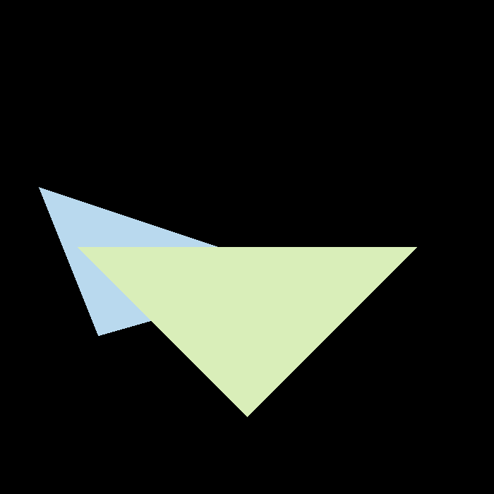
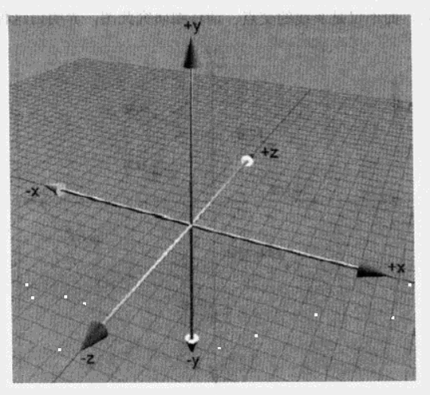
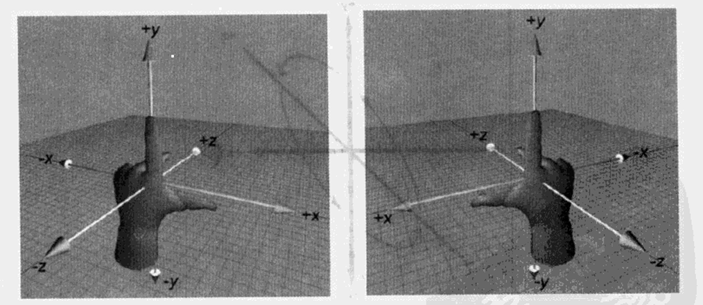
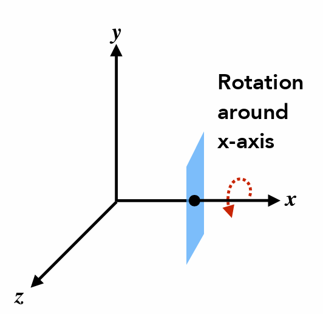
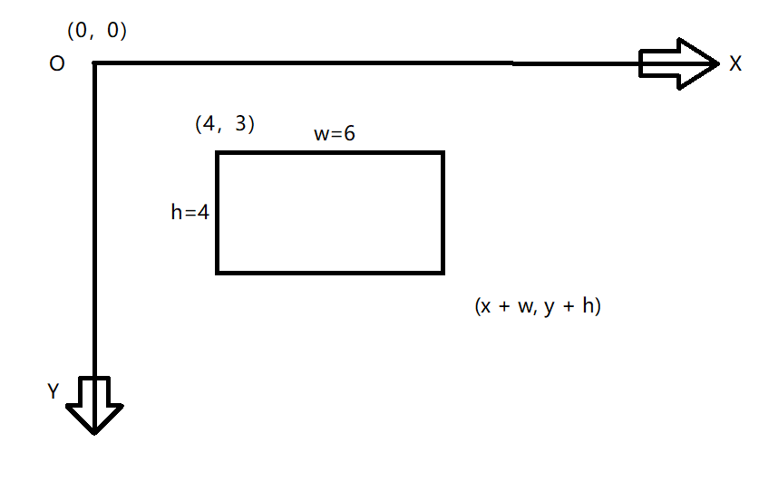
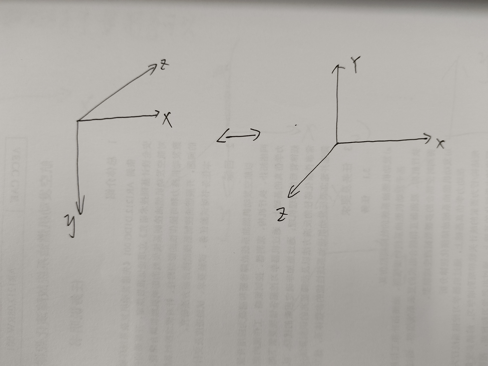
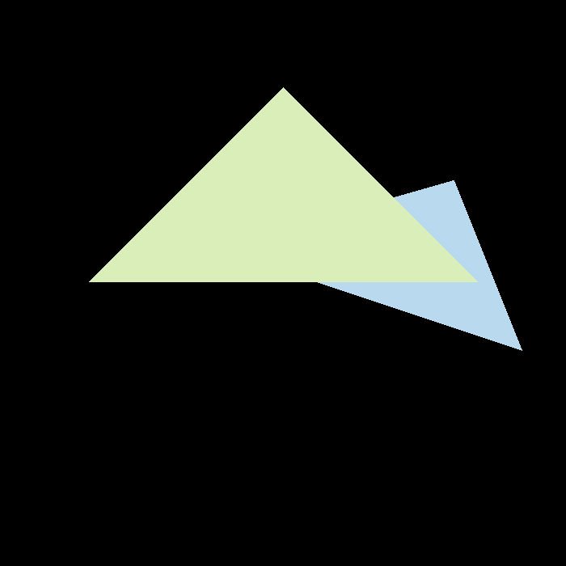

### 代码框架解读
作业1基本上理清了代码的逻辑，但是没有细究其中的数学细节，直接照搬了课上推导的数学公式和推导过程，导致了图像出现颠倒的情况。

### bug问题解决
做完作业2才发现作业1和作业2都存在相同的问题，图像上下颠倒以及左右颠倒。




关于左手坐标系以及右手坐标系：
在2维空间中，所有的二维坐标系都是等价的，也就是对于两个不同的坐标系A和B，可以通过旋转操作将坐标系A变换到和坐标系B重合。
但是在三维空间中，这个情况并不适用，假如有一个坐标系如图所示，+z是指向内部的，能否通过旋转操作保持x,y轴的方向不变，同时将z轴坐标指向图像的外侧呢？答案是否定的。


在三维空间中存在两种不同的坐标系：左手坐标系以及右手坐标系如图，同属一种坐标系的可以通过旋转操作变换为相同。


在设计3D图形世界的过程中，首先确定坐标系是相当重要的，比如是左手坐标系还是右手坐标系，+y的方向，以及+x的方向等等。


在MVP矩阵课程推导过程中，基于以下的假设：
1. 坐标系为右手坐标系并且坐标原点在x,y平面的左下角如图所示
2. 相机的位置：经过camera transformation 之后，相机需要位于坐标原点，向上方向为y轴的正方向，gaze at -z方向


那么在框架代码中采用的坐标系是怎么样的呢？
1. 在opencv中，坐标原点是在左上角的，也就是+y是向下的，如图所示：

2. 左手坐标系还是右手坐标系？从代码框架上我没有看出是左手坐标系还是右手坐标系，暂且默认是右手坐标系。也就是实际的坐标系是左图，推导projection matrix的坐标系是右图。解决问题的方式有两种，最好的方式是重新推导一个projection matrix,但是我懒。另一种处理方式自然是将左边的坐标系通过旋转变换得到右边的坐标系(右手坐标系内的坐标系都是等价的，实际上就是x不变，z和y取负数)，在右边的坐标系做projection之后再变换回左边的坐标系。



感觉主要导致问题的在于MVP变换中的projection transformation,我朴素的思想告诉我，直觉上是这样的但是我讲不明白，暂且搁置，也没有数学证明。
代码的主要修改在于projection transformation的matrix上，先变换到右边的坐标系(y,z取反)，做完perspective projection transformation 之后，再变换回来(y，z取反)：
```cpp
Eigen::Matrix4f get_projection_matrix(float eye_fov, float aspect_ratio, float zNear, float zFar)
{
    // TODO: Copy-paste your implementation from the previous assignment.
    Eigen::Matrix4f projection;
    
    Eigen::Matrix4f p2o;
    p2o << zNear,0,0,0,
           0,zNear,0,0,
           0,0,zNear+zFar,-zNear*zFar,
           0,0,1,0;
    
    float theta = eye_fov / 2 * MY_PI / 180.0;
    float top = zNear * tan(theta);
    float bottom = - top;
    float right = top * aspect_ratio;
    float left = -right;
    Eigen::Matrix4f translate;
    
    translate << 1,0,0,-(left + right)/2,
                 0,1,0,-(top + bottom)/2,
                 0,0,1,-(zNear + zFar)/2,
                 0,0,0,1;
    
    Eigen::Matrix4f ortho;
    ortho << 2.0/(right - left),0,0,0,
             0,2.0/(top - bottom),0,0,
             0,0,2.0/(zNear - zFar),0,
             0,0,0,1;
    Eigen::Matrix4f transform_coordinate;
    transform_coordinate<<1,0,0,0,
                          0,-1,0,0,
                          0,0,-1,0,
                          0,0,0,1;

    projection = transform_coordinate * ortho * translate * p2o * transform_coordinate;
    
    return projection;
}
```
最后得到正确的结果：



计算机图形学界有句名言，『计算机图形学第一准则：近似原则如果它看上去是对的它就是对的』。emm刚入门，还有很多疑问没有得到解答，这算是我粗浅的认知。


