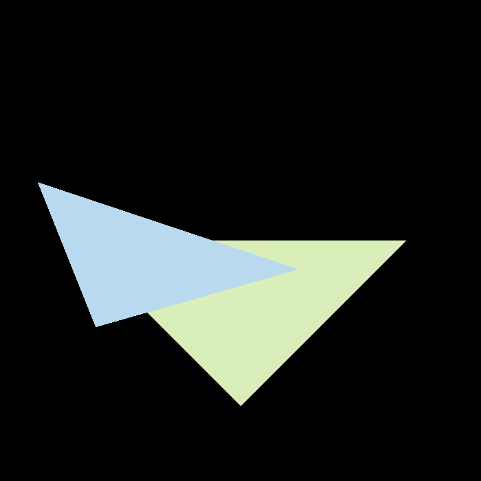

### 代码框架解读
作业1基本上理清了代码的逻辑，但是没有细究其中的数学细节，直接照搬了课上推导的数学公式和推导过程，导致了图像出现颠倒的情况。

### bug问题解决
做完作业2才发现作业1和作业2都存在相同的问题，图像上下颠倒以及左右颠倒。

关于左手坐标系以及右手坐标系：
在2维空间中，所有的二维坐标系都是等价的，也就是对于两个不同的坐标系A和B，可以通过旋转操作将坐标系A变换到和坐标系B重合。
但是在三维空间中，这个情况并不适用，假如有一个坐标系如图所示，+z是指向内部的，能否通过旋转操作保持x,y轴的方向不变，同时将z轴坐标指向图像的外侧呢？答案是否定的。

在三维空间中存在两种不同的坐标系：左手坐标系以及右手坐标系如图，同属一种坐标系的可以通过旋转操作变换为相同。

在设计3D图形世界的过程中，首先确定坐标系是相当重要的，比如是左手坐标系还是右手坐标系，+y的方向，以及+x的方向等等。

在MVP矩阵课程推导过程中，基于以下的假设：
1. 坐标系为右手坐标系并且坐标原点在x,y平面的左下角如图所示
2. 相机的位置：经过camera transformation 之后，相机需要位于坐标原点，向上方向为y轴的正方向，gaze at -z方向

那么在框架代码中采用的坐标系是怎么样的呢？
1. 在opencv中，坐标原点是在左上角的，也就是+y是向下的，如图所示：

