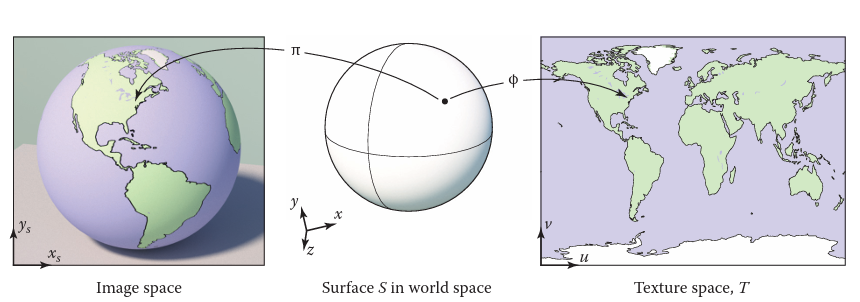

### 作业三 学习笔记
----

### 渲染管线

光栅化的过程和光线追踪的过程并不相同。光线追踪是遍历每一个像素，并且试图找到可能对该像素的颜色造成影响的物体。光栅化是依次遍历每一个object，并找到每一个当前object可能影响到的像素，并进行着色。找到每一个物体影响的像素的过程就是光栅化的过程，光栅化实际上是按照物体顺序进行渲染的。图形渲染管线实际上就是从world space中的物体出发，到更新屏幕空间中的像素的过程，如图所示。


输入是world space 中的三维顶点，经过vertex processing,也就是对三维空间中的点经过model transformation,camera transformation,projection transformation以及viewport transformation,输出vertex stream,也就是screen space中的顶点.

Rasterization接收screen space中的triangle作为输入，通过sample以及z-buffering找到屏幕上当前三角形会影响的像素，也就是fragment stream,fragment可以翻译为片元，可以理解为当前triangle可以影响的像素就是片元fragment。

Fragment processing 对给定的fragment stream 进行着色以及texture mapping.

从代码框架上来看对应着draw() -> rasterize_triangel() -> fragment_shader(),代码框架变化不大，还是能够轻松看懂的。

---
### shading
shading,着色，可以看作是将某种material 应用在物体表面的过程。

#### Blinn-phong Reflectance model 
Blinn-phong Reflectance model将每个shading point的光源划分为三种不同的类型：Specular highlights,diffuse reflection,Ambient lighting 三种不同的光照。
1. diffuse reflection
  需要定义三种不同的属性：
```math
  漫散射系数:k_d
```
```math
  到达shading point的光强：\frac{I}{r^2} 
```
```math
  shading point接收到的光强：max(0,l · n)
```

```math
L_d = k_d \times \frac{I}{r^2} max(0,l · n)
```
2. Specular highlight
   同样需要定义三种不同的属性：
```math
  高光系数系数:k_d
```
```math
  到达shading point的光强：\frac{I}{r^2} 
```

```math
  camera看到的光强：max(0,n · h)^p
```


```math
L_s = k_d \times \frac{I}{r^2} max(0,n · h)^p
```

3. Ambient lighting

  Assumption : add constant color to account for disregarded illumination and fill in black shadows.

```math
L_a = k_a \times I_a
```
---
### shading frequency
通常可以分为三种不同的shading 频率，分别是对整个面进行shading，以及对三个顶点进行shading并通过插值的方式得到三角形内部不同像素的shading result，还有就是对每一个pixel都做shading。

```cpp
Eigen::Vector3f phong_fragment_shader(const fragment_shader_payload& payload)
{
    Eigen::Vector3f ka = Eigen::Vector3f(0.005, 0.005, 0.005);
    Eigen::Vector3f kd = payload.color;
    Eigen::Vector3f ks = Eigen::Vector3f(0.7937, 0.7937, 0.7937);

    auto l1 = light{{20, 20, 20}, {500, 500, 500}};
    auto l2 = light{{-20, 20, 0}, {500, 500, 500}};

    std::vector<light> lights = {l1, l2};
    Eigen::Vector3f amb_light_intensity{10, 10, 10};
    Eigen::Vector3f eye_pos{0, 0, 10};

    float p = 150;

    Eigen::Vector3f color = payload.color;
    Eigen::Vector3f point = payload.view_pos;
    Eigen::Vector3f normal = payload.normal;

    Eigen::Vector3f result_color = {0, 0, 0};
    for (auto& light : lights)
    {
        
        Eigen::Vector3f light_direction = (light.position - point).normalized();
        Eigen::Vector3f view_direction = (eye_pos - point).normalized();

        auto r_2 = (light.position - point).squaredNorm();

        auto ambient_l = ka.cwiseProduct(amb_light_intensity);

        auto diffuse_l = kd.cwiseProduct(light.intensity / r_2) * std::max(0.0f,light_direction.dot(normal));

        auto h = (light_direction + view_direction).normalized();
        auto specular_l = ks.cwiseProduct(light.intensity / r_2) * std::pow(std::max(0.0f,h.dot(normal)),p);

        result_color += ambient_l + diffuse_l + specular_l;
        
        
    }

    return result_color * 255.f;
}
```
---

### Texture Mapping
在计算机图形学中，3d物体的表面不同位置会有不同的属性，但是3d物体表面的属性并不会改变物体的形状。为了实现这种物体表面：spatially varying surface properties,需要使用texture mapping 的技术：使用一张图片，texture map,来记录3d物体表面的细节信息，然后通过数学方式将texture map 上面的信息mapping到3d物体的表面。

#### Looking up texture value
为了将surface 表面的属性应用到fragment shading上面，需要从texture map 上面查找shading point的数值。texture map 上的坐标为(u,v)。
```cpp
Color texture_lookup(Texture t,float u,float v)
{
  int i = round(u * t.width() - 0.5);
  int j = round(v * t.height() - 0.5);
  return t.get_pixel(i,j);
}

Color shade_surface_point(Surface s,Point p,Texture t)
{
  Vector normal = s.get_normal(p);
  (u,v) = s.get_texcoord(p);
  Color diffuse_color = texture_lookup(t,u,v);
  //compute shading using diffuse color and normal
  //return shading result
}
```


如果需要查找shading point 对应的属性，需要知道shading point(image space)到u,v(texture space)的mapping，一般会三角形顶点对应的(u,v)坐标是已知的，只需要对三角形中间的像素插值得到(u,v)坐标即可。值得注意的是:
```math
(u,v) \in [0,1] ^ 2
```
---

###  三角形的插值

三角形的重心坐标，定义在不同三角形中的一套坐标系,可以使用重心坐标系表示三角形中的任意一个点：
```math
(x,y) = \alpha X_A + \beta X_B + \gamma X_C
```
并且重心坐标必须满足：
```math
\alpha + \beta + \gamma = 1\\
\alpha >= 0\\
\beta >= 0\\
\gamma >= 0\\
```

通过重心坐标可以通过三个顶点的属性插值得到三角形内部任意一个点的属性包括深度，法向量，颜色，texture map上的坐标等等。


### 透视插值矫正
直接对screen space 中的属性进行插值会得到错误的结果因为经过投影之后物体会变小，为了能够得到正确的结果，需要对插值的结果进行矫正。

物体上的点的变换过程是：


假设在world space 中存在两个点q和Q，对应的纹理坐标是(u,v)，需要插值q和Q中间的一个点q'的纹理坐标。在world space中也就是：
```math
q' = q + t(Q - q);
(u,v) = q_{(u,v)} + t(Q_{(u,v)} - q_{(u,v)})
```
经过投影变换之后，在screen space 中分别对应着s',s和S，那么在screen Space中的插值是：
```math
s' = s + \alpha(S - s);
(u,v) = s_{(u,v)} + \alpha(S_{(u,v)} - s_{(u,v)})
```
理论上s'和q'的纹理坐标应该是相同的，但是由于经过投影之后物体会变小，阿尔法和t并不相同，也就是在world space 以及screen space中得到的插值结果并不相同。
perspective transformation 具有一定的性质：会将平面投影为平面，线段投影为线段。考虑一个线段：q + t(Q - q),经过perspective transformation 矩阵变换之后：
```math
Mq + t(MQ - Mq) = r + t(R-r)
```
也就是homogenized 3D line segment is:
```math
\frac{r + t(R - r)}{w_r + t(W_R - w_r)}
```
可以被改写为：
```math
\frac{r}{w_r} + f(t)(\frac{R}{w_R} - \frac{r}{w_r})
and 
f(t) = \frac{w_Rt}{w_r + t(w_R - w_r)}
```
那么就可以得到两者之间的转换关系：
```math
t(\alpha) = \frac{w_r\alpha}{w_R + \alpha(w_r - w_R)} and \alpha(t) = \frac{w_Rt}{w_r + t(w_R - w_r)}
```
这样的计算方式太慢了。可以做的更加快。
假设需要插值的结果添加到变换后的点中：


由于投影之后线段依然是线段，平面依然是平面，显然可以通过三角形三个顶点插值得到上面的三个属性：
```math
(\frac{u}{w_r},\frac{v}{w_r},\frac{1}{w_r}) = \alpha(\frac{u_0}{w_0},\frac{v_0}{w_0},\frac{1}{w_0}) + \beta(\frac{u_1}{w_1},\frac{v_1}{w_1},\frac{1}{w_1}) + \gamma(\frac{u_2}{w_2},\frac{v_2}{w_2},\frac{1}{w_2})
```

最后整个算法就是：


