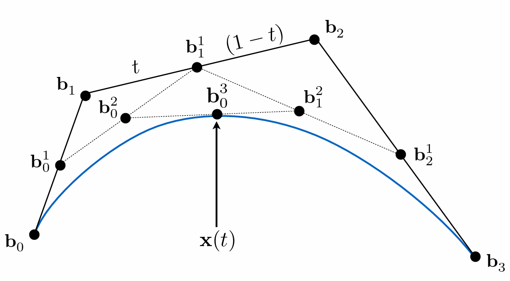
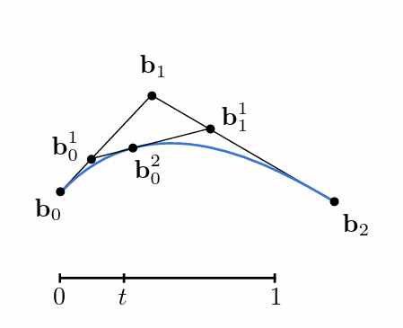
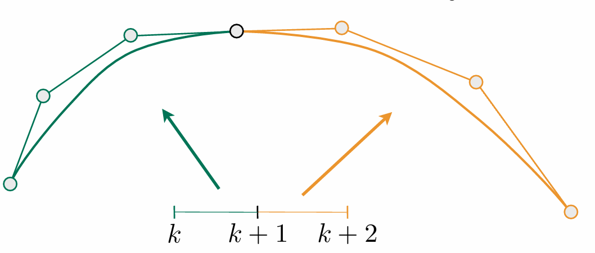
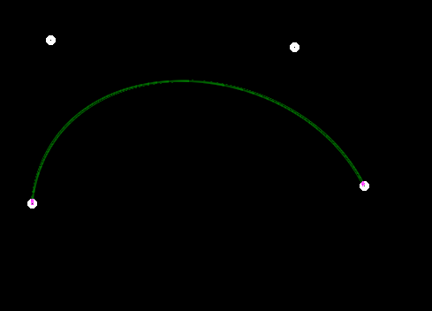
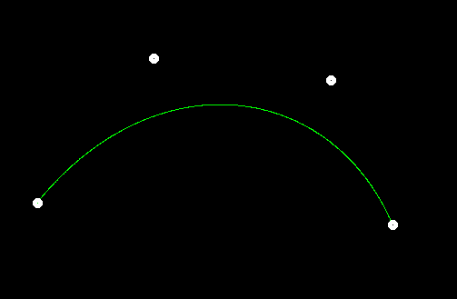
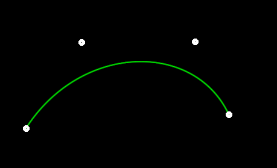

### 作业四学习笔记

### 贝塞尔曲线

通过控制点绘制贝塞尔曲线的算法：de Casteljau algorithm

算法原理如下图所示，最开始和最后的两个点也是贝塞尔曲线的起点以及中点，通过中间的控制点控制贝塞尔曲线的走向。

1. 将时间划分为[0,1]的时间，计算每一个时间步t上面的贝塞尔曲线的点

2. 对于时间步t，用t : (1-t) 分割每一条线段，并找到分割点

3. 将分割点作为新的控制点

4. 直到控制点的数目只有一个，就是当前时间上的贝塞尔曲线的取值

### 贝塞尔曲线的数学表示

以三个控制点的贝塞尔曲线为例：

那么有：

$$
b_0^1 = b_0 + (b_1 - b_0) \times t = (1-t)b_0 + tb_1 \tag 1
$$

$$
b_1^1 = (1-t)b_1 + tb_2 \tag 2
$$

第二次线性插值：

$$
b_0^2 = (1-t)b_0^1 + tb_1^1 \tag 3
$$

将(1)(2)代入(3)中可得：

$$
b_0^2(t) = (1-t)^2b_0 + 2t(1-t)b_1 + t^2b_2
$$

可以看到前面的系数实际上就是二项式展开的系数。

贝塞尔曲线的一般表示形式：

$$
b^n(t) = b_0^n(t) = \sum_{j = 0} ^ n b_jB_j^n(t)
$$

其中n表示控制点形成的线段一个有n条，并且控制点$b_j$的数目一共有n + 1个。$B_j^n(t)$是Bernstein polyminal,是二次多项式的一种。

一般的二次多项式展开为：

$$
(a + b) ^ n = \sum_{r = 0}^nC_n^ra^{(n-r)}b^r
$$

实际上二次多项式展开是排列组合的问题：

可以看作是n个(a + b)相乘，可以将选多少个b进行分类，一个有n+1类，选取r个b的结果就是：

$$
C_n^r a^{(n-r)}b^r\\
C_n^r = \frac{n!}{r!(n-r)!}
$$

Bernstein polyminal :

$$
B_j^n(t) = C_n^jt^j(1-t)^{(n-j)}
$$

贝塞尔曲线具有的数学性质：

1. 通过数学形式计算切线

2. Affine transformaton property: Transfrom curve by transforming control points

3. Convex hull property : curve is within conves hull of control points

高维的贝塞尔曲线如何绘制：划分成多个低维的贝塞尔曲线并拼接起来。

如何保证连接处的平滑：

控制点切线方向相同并且长度相等。

如图：

### 作业提高部分：

实现对贝塞尔曲线的反走样：对于一个曲线上的点，不止将其看作是一个像素，并且根据到像素中心点的距离考虑相邻像素的距离。

考虑相邻的八个像素的距离，根据ratio对像素值255进行放缩，ratio in [0,1]。到像素的中心的最长距离是$\frac{3\sqrt2}{2}$, 那么ration的取值应该为$1 - \frac{\sqrt2d}{3}。

值得说明的是对相邻的像素值的更新需要和原来的像素值取max,否则会导致曲线不正常的暗断断续续。如下图：

反走样前：

反走样后：

