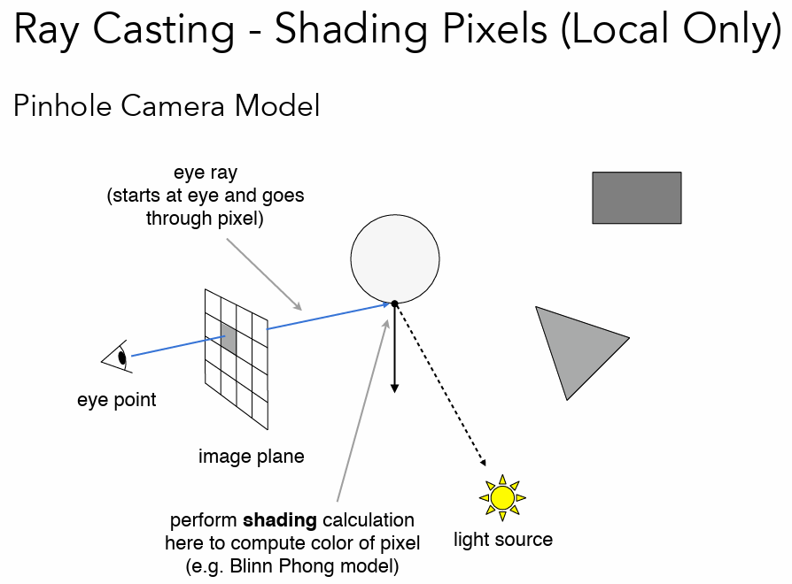
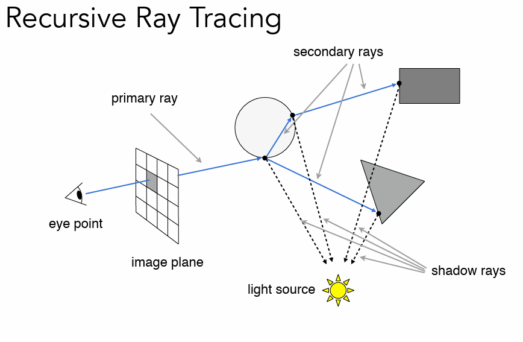
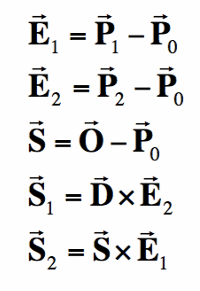
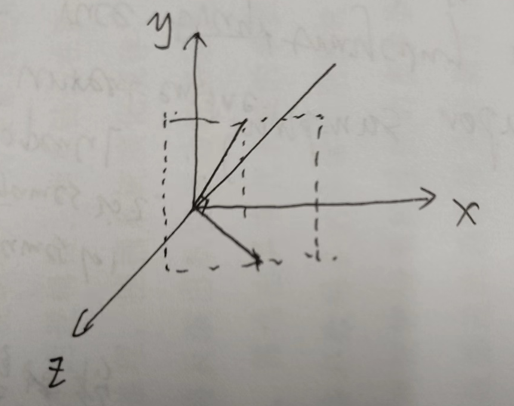
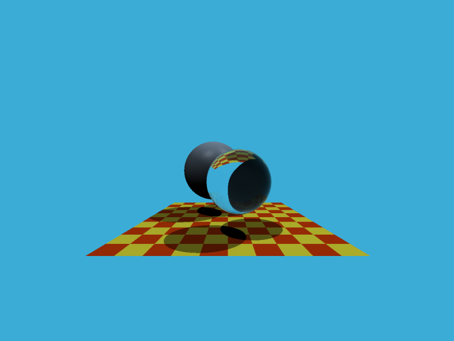

### 作业5 学习笔记 & 代码框架解读

---

### Whitted-Style  Ray Tracing

### Why ray tracing?

计算机图形学中主要有两种成像的方式：光栅化以及光线追踪。光栅化是遍历每一个物体，并计算该物体对图片像素的影响。光线追踪是从图片上的像素出发，查找到可能对该像素造成影响的物体并综合计算该像素的数值。

1. rasterization is fast but qulaity is relatively low

2. ray tracing is accurate but is slow 

3. rasterization couldn't handle global effects well: soft shadows and especially when the light bounces more than once

### how to do ray tracing?

three ideas about light rays:

1. travels straight lines

2. do not collide with each other

3. 光路可逆

如图所示，我们需要对image plane上面的一个pixel进行计算，需要从camera出发，向该像素投射出一个光线，在3D空间中查找到第一个和光线相交的shading point。从shading point出发，和光源之间再连接一条光线，判断当前的shading point是否能够被光源看到。如果看不到就是在shadow里面，如果可以看到，则通过Blinn Phong model 进行着色，并将着色的结果写到该像素中。



由于光线是会不断反射和折射的，只考虑光源到shading point 肯定是不足够的，需要考虑不断折射以及反射的光路，并综合每一条光路上的着色结果。



其中最关键的一步就是求解光线和物体之间的交点。

给定光线的起点o以及光线的方向d，那么光线的方程就是：

$$
r(t) = o + td \tag 1
$$

其中：

```math
0=< t < \infty
```

求解交点实际上就是求解方程组的过程。

球体sphere p：

$$
(p - c) ^ 2 - R^2 = 0 \tag 2
$$

将(1)代入(2)中可得：

$$
(o + td - c) ^ 2 - R^2 = 0 \tag 3
$$

解(3)可得相交的时间t。

光线和三角形(triangel mesh)相交。

1. rendering : visibility, shadows, lighting .....

2. Geometry : inside / outside test

3. 遍历模型中的每一个三角形

4. 判断ray和triangle是否相交

判断ray light 和 plane是否相交：

1. 计算ray light 和三角形所在平面的交点

2. 判断交点是不是在三角形内部

三角形所在平面：法线N以及平面上的一个点p'

$$
plane: N(p - p') = 0 \tag 4
$$

将(1)代入(4)中可知：

$$
N(o + td - p') = 0 \tag 5
$$

解得

$$
t = \frac{(p' - o)N}{dN}
$$

同时需要检查t的取值范围。

更快速的判断ray light 是否和三角形相交的解法：Moller Trumbore Algortithm

$$
o + td = (1 - b_1 - b_2)P_0 + b_1P_1 + b_2P_2 \tag 6
$$

公式六实际上是三个未知数和三个方程的方程组，可以直接解出结果：

```math
\begin{bmatrix}
t\\
b_1\\
b_2\\
\end{bmatrix} =

\frac{1}{S1E1}

\begin{bmatrix}
S2E2\\
S1S\\
S2D\\
\end{bmatrix}
```

其中：



### 代码框架解读

首先需要定义整个场景：场景中包含物体以及光线：

```cpp
class Scene
{
public:
    // setting up options
    int width = 1280;
    int height = 960;
    double fov = 90;
    Vector3f backgroundColor = Vector3f(0.235294, 0.67451, 0.843137);
    int maxDepth = 5;
    float epsilon = 0.00001;

    Scene(int w, int h) : width(w), height(h)
    {}

    void Add(std::unique_ptr<Object> object) { objects.push_back(std::move(object)); }
    void Add(std::unique_ptr<Light> light) { lights.push_back(std::move(light)); }

    //[[nodiscard]]是一种属性，用于指示编译器调用函数以及访问类成员变量时函数的返回值不能被忽略
    [[nodiscard]] const std::vector<std::unique_ptr<Object> >& get_objects() const { return objects; }
    [[nodiscard]] const std::vector<std::unique_ptr<Light> >&  get_lights() const { return lights; }

private:
    // creating the scene (adding objects and lights)
    std::vector<std::unique_ptr<Object> > objects;
    std::vector<std::unique_ptr<Light> > lights;
};
```

场景中的光线：light,定义了position以及intensity

object主要是球体以及地板(通过三角形进行定义)

定义好了场景接下来就是光线追踪的过程：对每个像素投射出一条光线并通过recursive ray trracing 计算该像素的值。

```cpp
void Renderer::Render(const Scene& scene)
{
    std::vector<Vector3f> framebuffer(scene.width * scene.height);

    float scale = std::tan(deg2rad(scene.fov * 0.5f));
    float imageAspectRatio = scene.width / (float)scene.height;
    std::cout<<scale<<" "<<imageAspectRatio<<std::endl;
    // Use this variable as the eye position to start your rays.
    Vector3f eye_pos(0);
    int m = 0;
    for (int j = 0; j < scene.height; ++j)
    {
        for (int i = 0; i < scene.width; ++i)
        {
            // generate primary ray direction
            float x = ((float)i + 0.5) / float(scene.width);
            float y = ((float)j + 0.5) / float(scene.height);

            x = x * 2.0f - 1.0f;
            y = y * 2.0f - 1.0f;

            x *= scale *imageAspectRatio;
            y *= -scale;
            // TODO: Find the x and y positions of the current pixel to get the direction
            // vector that passes through it.
            // Also, don't forget to multiply both of them with the variable *scale*, and
            // x (horizontal) variable with the *imageAspectRatio*             

            Vector3f dir = Vector3f(x, y, -1); // Don't forget to normalize this direction!
            dir = normalize(dir);
            framebuffer[m++] = castRay(eye_pos, dir, scene, 0);
        }
        UpdateProgress(j / (float)scene.height);
    }
```

关于将成像平面在3d空间中坐标的计算：



world space中的成像平面是位于z = -1处，并且fov = 90度，那么

$$
scale = tan(fov/2) = tan(45^o) = \frac{y/2}{1}
$$

那么

$$
y \in [-1,1] = [-scale,scale]
$$

那么

$$
x \in [-imageAspectRatio,imageAspectRatio]
$$

那么自然是要将图片的坐标变换回去world space 中的坐标。

$$
[0,width] \times [0,height] ->[0,1]\times [0,1] ->[-1,1] \times[-1,1] ->[-ratio,ration]\times [-scale,scale]
$$

由于在绘制图片是y轴是向下递增的，所以需要乘于的是-scale.

在接下来就是对光线的不断递归投射出去，直到投射次数达到了5，首先是通过trace函数判断和哪些物体相交并且找到最近的交点hitPoint，需要计算交点hitpoint的颜色。考虑物体表面两种不同材质：反射和折射，反射

1. 反射和折射：计算反射和折射的原点以及方向并投射两条光线到场景中，并通过一定比例混合两种color

2. 反射：计算反射的原点以及方向并投射到场景中，并通过一定比例衰减color

3. diffuse and glossy 就会使用phong model 着色并返回


### 结果


