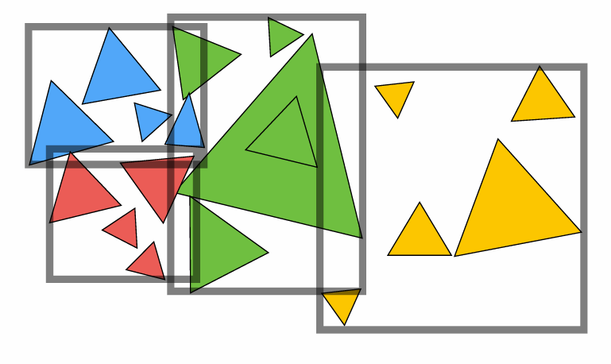
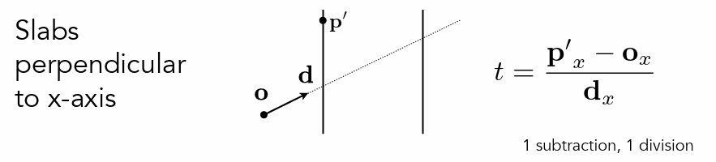

### 作业6 学习笔记 & 代码框架

---

### 加速求解交点的过程

---

### Object Partitions & Bounding Volume Hierarchy

如下图所示，主要是通过对3d空间中的三角形进行划分，将三角形集合划分为两个数量相同的子集即可

1. find bounding box

2. recursively split set of objects into subset

3. recompute the bouding box of the subsets

4. stop when necessary

5. store the objects in each leat nodes



步骤二中如何等量划分三角形数目：

1. 选择节点中最长的轴
2. 选择中间的object进行划分

为什么需要选择最长的轴？

如何计算中间节点？

快速排序的只quicksort其中一半。

Data Structure for BVH tree:

1. Internal Nodes
   
   1. bounding box
   
   2. children pointer

2. leaf nodes
   
   1. bounding box
   
   2. list of objects'

遍历BVH树：

```cpp
Intersect(Ray ray,BVH node)
{
    if(ray misses the bounding box) return;

    if(node is a leaf node)
    {
        test all the objects;
        return closest intersection;
    }

    hit1 = Intersect(ray,node.child1);
    hit2 = Intersect(ray,node.child2);

    return the closest hit;

}
```

### 判断bounding box和光线相交

Axis-Aligned Bounding box : box is the intersection of 3 pairs of slabs

判断的关键：

1. the ray enter the box only when it enters all pairs of slabs

2. the ray exits the box as long as it exits any pair of slabs

计算每对平面的$t_{min}$ 和 $t_{max}$:

$$
t_{enter} = max(t_{min})\\
t_{exit} = min(t_{max})
$$

如果进入时间<离开时间，那么说明光线在盒子里面待了一段时间也就是有交点。

但是光线是射线，并不是直线。

1. exit < 0:盒子在光线的后面，并没有相交。

2. exit >= 0 && enter <0 ,光源在直线内部

综上：

相交：enter < exit && exit >= 0


