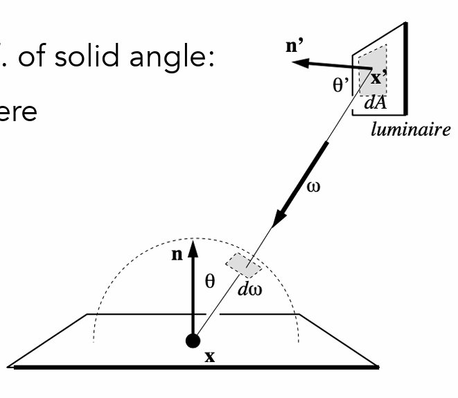

### 学习笔记

----

### 辐射度量学(radiometry)

如何正确度量光线而不是像blinn-phong model 一样只是给光照的强度一个给定的实数值，没有单位。

definition : measurement system and units of illumination which can perform lighting calculations in a physically correctly manner.

度量光线需要的物理量：radiant energy, radiant flux, intensity,irradiance and radiance

### 

### Radiant energy

光照的能量：Q (单位焦耳)

### Radiant flux

功率(power)：energy per time(单位瓦特)

$$
d \phi = \frac{dQ}{dt}
$$

### 

### Intensity: describe the light emitted from a source

intensity : power per solid angle 

$$
I(w) = \frac{d \phi}{dw}
$$

solid angle的定义：

$$
w = \frac{S}{r^2}
$$

一个球体的立体角是$4\pi r^2 / r^2 = 4 \pi$

differential solid angel:


在极小的变化中，可以将面积dA看作是长方形。

根据圆的弧度的定义：

$$
d\phi = \frac{a}{rsin\theta}\\
d\theta = \frac{b}{r}
$$

求出两条边之后：

$$
dA = (rd\theta)(rsin\theta d\phi)
$$

那么：

$$
dw = \frac{dA}{r ^ 2} = sin \theta d \theta \phi
$$

we will use w to denote a direction vector(unit length)

### irradiance: describe lights falling on a surface

definition : power per unit area

$$
E(x) = \frac{d\phi(x)}{dA}
$$

同时和blinn-phong model 一样，需要考虑光线和shading point 之间的夹角。

$$
E = \frac{\phi}{A}cos\theta
$$

从另外的角度来看blinn phong model 中的光线衰减：

r = 1 时：

$$
E_1 = \frac{\phi}{\pi}
$$

r = r 时：

$$
E_r = \frac{\phi}{\pi r^2} = \frac{E_1}{r^2}
$$

也就是衰减的并不是intensity 而是 irradiance

### radiance : describe a light traveling along the ray

Radiance is the fundamental field quantity that describes the distribution of light in an environment. Rendering is all about computing the radiance.


definition : power per unit solid angle,per unit project area

$$
L(p,w) = \frac{d^2 \phi}{dwdAcos\theta}
$$

radiance 和 intensity 和irradiance:

intensity : power per unit solid angle

irradiance : power per unit area

so

radiance : intensity per unit project area

radiance : irradiance per unit solid angle

由于渲染实际上就是计算shading point 的光照，也就是首先需要定义shading point接受到的和发射出去的radiance,

shading point的入射radiance (某个角度入射的radiance,实际上也是irradiance per unit solid angle,从某个角度接收到的irradiance):


$$
L(p,w) = \frac{dE(p)}{dwcos\theta}
$$

为什么需要cos呢？需要将dw投影到垂直于dA的方向，从定义上看，radiance要求per unit project area.

shading point的出射radiance(intensity per unit projected area leaving the surface)


$$
L(p,w) = \frac{dI(p,w)}{dAcos\theta}
$$

再重新看以下radiance以及irradiance 之间的关系：

irradiance : dA接收到的所有radiance

radiance : dA从某个立体角接收到的power

$$
dE(p,w) = L_i(p,w)cos\theta dw
$$

$$
E(p,w) = \int_{H^2}L_i(p,w)cos\theta dw
$$

### BRDF(bidirectional reflectance Distribution Function)

path tracing 路径追踪实际上就是计算radiance的大小，一个shading point的颜色取决于进入到eye中radiance的大小，也就是需要知道一个方向为wi的radiance入射到shading point ,然后向另一个方向wr发射的radiance 的大小。


已知入射的radiance : L(p,wi)，需要求解某个角度出射的radiance：可以看作入射的randiance 转换为shading point 接收到的irradiance，然后irradianc往另外一个方向发射一个radiance.

$$
dE(p,w_i) = L(p,w_i)cos\theta _i dw_i
$$

最最关键的定义：BRDF，bidirectional reflectance distribution function:

represents how much light is reflected into each outgoing  each outgoing direction wr from each incoming direction.

大白话就是：一个shading point 上的某个方向上的irradiance 发射到不同的方向的radiance的大小。

$$
f_r(p,w_i->w_r) = \frac{dL_r(w_r)}{dE_i(w_i)} = \frac{dL_r(w_r)}{L_i(w_i)cos\theta_idw_i}
$$

那么自然，反射方程(reflectance equation)自然就是：将所有方向wi的radiance反射到wr方向上面加和

$$
L(p,w_r) = \int_{H^2} f_r(p,w_i -> w_r)L_i(w_i)cos\theta_idw_i
$$

这是一个递归的方程，入射的光线决定出射光线，入射光线实际上也是来自别的反射光线。

渲染方程：

给shading point 加上一个发光项。

$$
L(p,w_r) = L_e(p,w_o) + \int_{H^2}L(p,w_i)f_r(p,w_i->w_r)(nw_i)dw_i
$$

we assum that all directions are point outforwards!!!

L(p,w_i)可以是incident light(from light source)也可以是reflected light.

kernal of function : L = E + KL，不是很懂！

$$
L = E + KE + K^2E + K^3E + .......
$$

E: shading point 直接发光

KE: 直接光照

其余均是间接光照，rasterization擅长处理E和KE.

### 蒙特卡洛积分

求解积分的近似方法：以pdf的随机分布在定义域上进行采样，对采样到的f(x)进行平均。

$$
\int_b^af(x)dx

$$

$$
X_i  - p(x)
$$

$$
F_N = \frac{1}{N}\sum_{i=1}^{N}\frac{f(X_i)}{p(X_i)}
$$

为什么是除以pdf?

$$
E(F_N) = E(\frac{1}{N}\sum_{i=1}^{N}\frac{f(X_i)}{p(X_i)})\\
= \frac{1}{N}\sum_i^N E(\frac{f(X_i)}{p(X_i)})\\
= \frac{1}{N}\sum_i^N \int_a^b \frac{f(X_i)}{p(X_i)}p(X_i)dx\\
= \int_a^b f(x) dx
$$

也就是期望值是无偏！但是直观的解释老是想不到，为什么是除以不是乘于？老是觉得应该乘上pdf.

1. 采样率越高，方差越小

2. sample on x, integrate on x 

### Path tracing

witted-style ray tracing:

1. always perfrom specular reflections / refraction 

2. stop bouncing at a diffuse surface

all these simplication is reasonable but nor accurate!!!!

The redering equation is right!!!!

$$
L(p,w_o) = L_e(p,w_o) + \int_{H^2} L(p,w_i)f_r(p,w_i->w_o)cos \theta_idw_i
$$

考虑直接光照的情况：


$$
L(p,w_o) = \int_{H^2} L(p,w_i)f_r(p,w_i -> w_o)cos\theta_idw_i
$$

采用蒙特卡洛积分的方式计算积分：

采样的随机变量是w,半球上的立体角。

$$
L(p,w_o) = \frac{1}{N}\sum_{i = 1}^{N} L(p,w_i)f_r(p,w_i,w_o)cos\theta_i/pdf(w_i)
$$

$$
pdf(w_i) = \frac{1}{2\pi}
$$

那么对于一个点的直接光照的shading 着色算法就是：

```cpp
shade(p,wo)
{
    randomly choose n wi from pdf;
    L0 = 0.0f;
    for each wi:
        trace a light r(p,wi);
        if r hit the light:
            L0 += (1 / N) * Li * fr * cos / pdf(wi); 
}
```


考虑间接光照之后的着色算法就是：

```cpp
shade(p,wo)
{
    randomly choose N wi from pdf;
    L0 = 0.0f;
    for each wi:
        trace a light r(p,wi);
        if r hit the light:
            L0 += (1 / N) * Li * fr * cos / pdf(wi);

        else if r hit an object at q:
            L0 += (1 / N) * shade(q,-wi) * fr * cos / pdf(wi) 
}
```

每次都采样n条光线会导致指数爆炸的问题，所以N=1；

```cpp
shade(p,wo)
{
    randomly choose 1 wi from pdf;
    L0 = 0.0f;
    for each wi:
        trace a light r(p,wi);
        if r hit the light:
            L0 += Li * fr * cos / pdf(wi);

        else if r hit an object at q:
            L0 += shade(q,-wi) * fr * cos / pdf(wi) 
}
```

对于每个像素，会产生多条光线并计算radiance.

```cpp
ray_generation(camPos,pixel)
{
    uniformly choose N sample positions within pixel;
    pixel_radiance = 0.0f;
    for each sample positions:
        trace a light r(camPos,cam_to_sample)
        if the ray hit the scene at p:
            pixel_radiance += (1 / N) * shade(p,sample_to_cam)
    return pixel_radiance;
}
```

one more problem : recursive program will not stop;

Russian Roulette(俄罗斯轮盘赌)

setting a Russian Roulette probability : P

1. within P , shoot a ray and get the result  L0 / P

2. within 1-P, return 0

期望也是无偏的

$$
E = p(L0/p) + (1-p) * 0 = L0 
$$

添加俄罗斯轮盘赌之后：

```cpp
shade(p,wo)
{
    set a probability p_rr;
    randomly select ksi in a uniform dist in [0,1];
    if(ksi > p_rr) return 0.0f;

    randomly choose 1 wi from pdf;
    L0 = 0.0f;
    for each wi:
        trace a light r(p,wi);
        if r hit the light:
            L0 += Li * fr * cos / pdf(wi);

        else if r hit an object at q:
            L0 += shade(q,-wi) * fr * cos / pdf(wi) 
}
```

至此光线追踪技术已经是正确的了，但是并不高效，每次只发射一条光线，能不能达到light完全是随缘的，特别是area light 很小的情况下。


如何能够确保采样的方向一定能够打到光源呢？不是在shading point 的半球上面采样，而是在光源上面采样，就能够保证一定能够打到光源了！



渲染方程中的积分项为dw:

$$
L(p,w_o) = \int_{H^2}L(p,w_i)f_r(p,w_i,w_o)cos\theta_idw_i 
$$

需要先将渲染方程中的积分项替换为dA:

两个面积处在不同的半球上面，但是solid angle 都是相同的，那么：

$$
dw = \frac{dAcos\theta '}{|x - x'|^2}
$$

那么渲染方程可以改写为：

$$
L(p,w_o) = \int_{H^2}L(p,w_i)f_r(p,w_i,w_o)cos\theta_i \frac{cos\theta '}{|x - x'|^2}dA
$$

$$
pdf = \frac{1}{A}
$$

现在，可以将radiance划分为两个不同的部分：

1. light source (do not need RR)

2. other reflectors(need RR)

```cpp
shade(p, wo)
     # Contribution from the light source.
     Uniformly sample the light at x’ (pdf_light = 1 / A)
     shoot a ray from p to x';
     if the ray is not blocked:
     L_dir = L_i * f_r * cos θ * cos θ’ / |x’ - p|^2 / pdf_light 
     # Contribution from other reflectors.

     L_indir = 0.0
     Test Russian Roulette with probability P_RR
     Uniformly sample the hemisphere toward wi (pdf_hemi = 1 / 2pi)
     Trace a ray r(p, wi)
     If ray r hit a non-emitting object at q
         L_indir = shade(q, -wi) * f_r * cos θ / pdf_hemi / P_RR
     Return L_dir + L_indir
```
