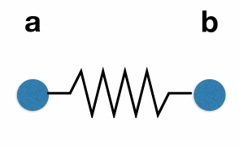
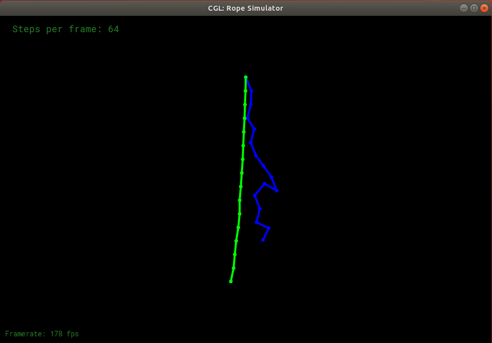

### 学习笔记

---
### 弹簧质点系统
---
可以通过数值模拟的方式生成物体的运动。

弹簧质点系统是一根弹簧的两端系着拥有一定质量的质点。

根据胡克定律可知，质点a受到的弹力为：
$$
f(a->b) = ks \frac{b - a}{||b - a||}(||b - a|| - l)
$$

其中ks 为弹性系数，单位向量表示方向，l是弹簧原本的长度。

上面的胡克定律存在的问题是，一旦弹簧被拉开之后，弹簧就会不断运动，并没有能量上的衰减。

可以沿着物体的速度v的反方向施加一个力，使得物体的运动停止。

$$
f_b = -kd \times vb
$$

不过只是简单的施加一个阻力是可能存在问题的，比如弹簧保持原来的长度，并且质点ab都沿着相同方向以相同的速度移动，此时质点之间也是会存在阻力的，这个也是不符合常理的，也就是这个阻力应该和质点ab之间的相对运动关系相关。

那么一个质点受到的阻力的大小应该为：
$$
f_b = -kd\frac{b - a}{||b - a||}(v_b - v_a)\frac{b - a}{||b-a||}
$$

以上便可以求解一个质点受到的弹力，根据牛顿运动定律可以求解质点的加速度，速度以及位移，那么如何更新质点的位置呢？

### 显式欧拉方法

1. 简单的迭代
2. 非常不准确
3. 通常是不稳定的

选取一小段时间根据运动学公式更新位移以及速度。
$$
x^{t + \Delta t } = x^t + \Delta t \times v^t
$$

$$
v^{t + \Delta t} = v^t + \Delta t a^t
$$

### mid point method
取中点的速度来更新位置。

$$
x_{mid} = x(t) + \Delta t / 2 \times v(x(t),t)
$$

$$
x(t + \Delta t) = x(t) + \Delta t \times v(x_{mid},t)
$$

### 隐式欧拉方法

1. 通常被称为backward method
2. 使用未来的速度来更新当前的位移

$$
x ^ {t + \Delta t} = x^t + \Delta t \times v^{t + \Delta t}
$$

$$
v ^ {t + \Delta t} = v^t + \Delta t a^{t + \Delta t}
$$

### Runge-Kutta Families

1. 用于求解微分方程组的方法
2. 四阶的方法，aka RK4

Verlet积分根据以下的方式更新位移：
$$
x(t + 1) = x(t) + (x(t) - x(t-1)) + a(t) * dt * dt
$$

### 结果

